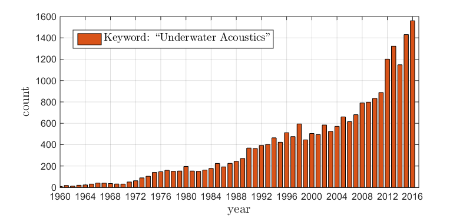
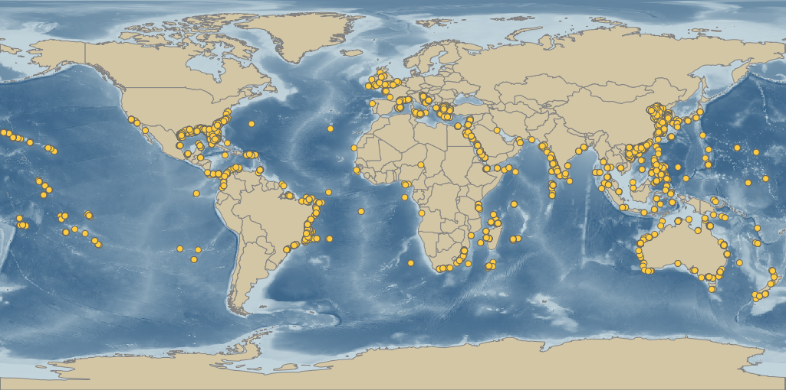
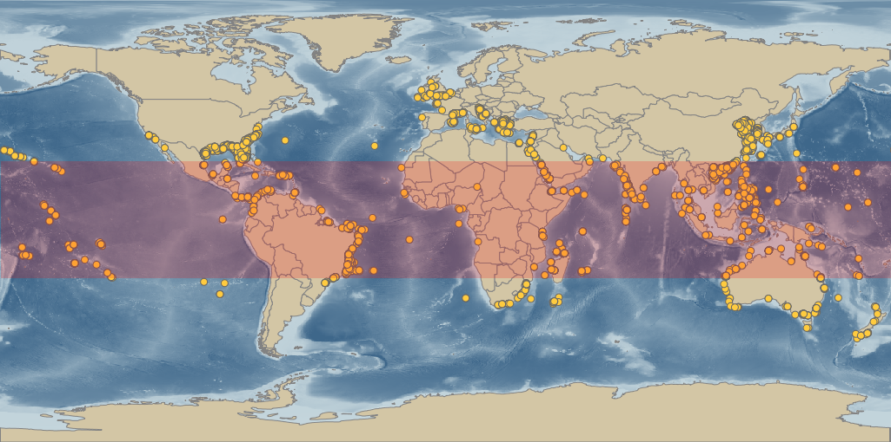
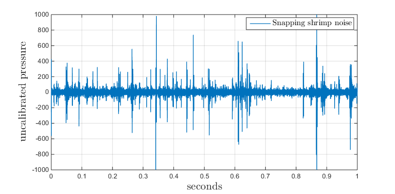
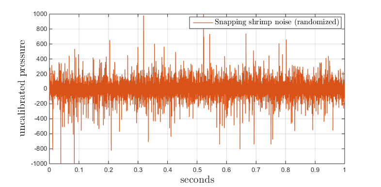
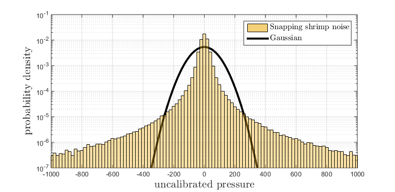
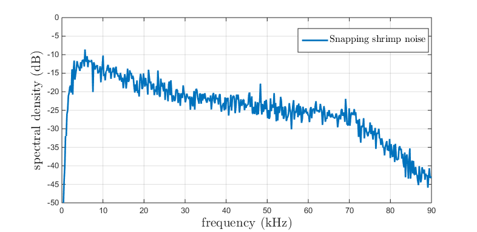
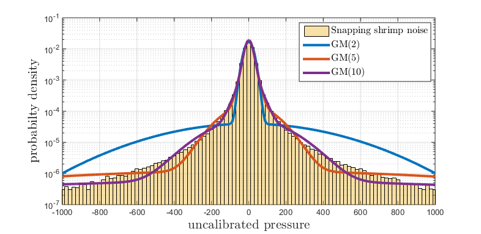
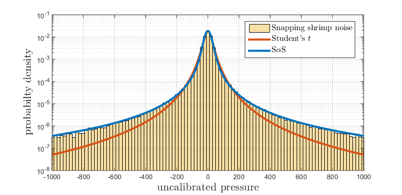
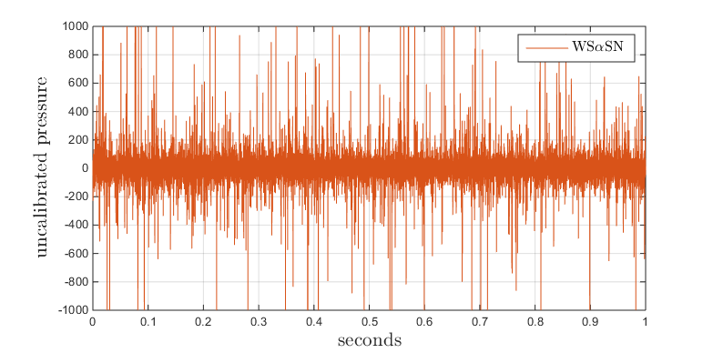

## The purpose of this article

In recent years, a significant chunk of work has been devoted to understanding snapping shrimp noise and its impact on underwater acoustic systems. It has indeed been established that conventional (Gaussian) noise models and techniques are extremely ineffective in modeling and mitigating snapping shrimp noise. The Acoustic Research Laboratory (ARL) at the National University of Singapore (NUS) has offered much in this regard. Yet with the constant onslaught of new research, it is important that the past be put in perspective. New works need to be analyzed and interpreted within previously established results. Have we been progressive, i.e., converted previous wrongs to rights? Or is it the other way around? In any case, a frank article of this sort has long been due. The article is directed not only towards new researchers in the underwater acoustics community, but offers a tutorial to anyone curious enough to know what snapping shrimp noise is, how prevalent it might be and how it has been modeled in the literature.

The first thing I would like to talk about is the motivation behind addressing snapping shrimp noise. Though the oceanic community is well-aware of the phenomenon, the global scale of this is known only to a few. Therefore, to most, its true impact may not be truly understood. The interested reader is directed to [Part 1: The marvelous snapping shrimp!](#P1) in this regard. This section also includes snippets of sound files recorded in snapping shrimp waters and some fun videos too.

The oceanic research community has seen substantial growth since the early 90s. A quick search for the term 'Underwater Acoustics' in [Web of Science](https://webofknowledge.com/){:target="_blank"} gives us the following hits per year:


<!--![alt text][ArticlesUWAcoustics]
[ArticlesUWAcoustics]: /images/11.png "Annual hits for underwater acoustics"-->


<a name="ArticlesUWAcoustics"></a>

This explosive interest is indeed welcome, as it pushes research frontiers forward at rates never fathomed before. However, it brings along with it certain unfortunate caveats. In reference to snapping shrimp noise, I have found a certain disconnect between findings reported in the literature and some of the works that have come over these last few years. There is a knack of employing various statistical noise models for snapping shrimp noise which are imported from other branches of research. Though such models may be based on substantiated claims there, they are not supported by recorded snapping shrimp data whatsoever. <!-- It is somewhat unfortunate that such works have not reverted tp research spanning over decades, that has painstakingly investigated the snapping shrimp noise process, slowly building statistical models to where they stand today. I may be incorrect, but I think the underlying reason that has contributed to this trend is that researchers new to the oceanic community bring with them a thought heavily defined by works in their areas of expertise. Some are oblivious to the fact that underwater acoustic signal processing has evolved much on its own. Consequently, it is probable that they think themselves to be introducing novel concepts to the area. --> 
This path needs to be corrected and such myths need to be put down. To do so, this article offers a tutorial-like approach and analyzes recorded snapping shrimp noise data in [Part 2: Analyzing snapping shrimp data](#P2). Moreover, models substantiated in the literature are also briefly introduced in [Part 3: Modeling snapping shrimp noise](#P3). The highlight amongst all is the αSGN(m) model. We end up by providing a MATLAB code that generates random variates and is open to all who need to use it (coming soon :sweat_smile:).

## <a name="P1"></a> Part 1:The marvelous snapping shrimp!

### A quick intro.

The snapping shrimp (family Alpheidae) is an eccentric family of crustaceans. Immediately recognizable due to its asymmetric front pincers, these shrimp colonize warm coastal waters throughout the world. The larger of its two pincers is able to produce snaps (large surges in acoustic pressure) which are strong enough to stun or even kill small prey. It was initially hypothesized that the sound was an outcome of the two halves of the pincer physically colliding into each other. However, this has long been proven false and the phenomenon is attributed to imploding bubbles that are formed from the rapid closure of the pincer, or in other words, cavitation.

The shrimp thrive in their natural habitat and it is common to see the seabed/shallow water coral littered with the noisy crustaceans. It is hypothesized that the snapping shrimp use their snaps not only to hunt prey and ward of unwanted predators, but also to communicate with each other. Diving in snapping shrimp infested waters offers a unique experience as one can literally hear constant crackling in the background. A clip recorded in Singapore waters is given below:

<iframe width="100%" height="166" scrolling="no" frameborder="no" allow="autoplay" src="https://w.soundcloud.com/player/?url=https%3A//api.soundcloud.com/tracks/331067083&color=%23ff5500&auto_play=false&hide_related=false&show_comments=true&show_user=true&show_reposts=false&show_teaser=true"></iframe>

Amazing right?! For the curious, the audio is sampled at 60 kHz and represents the unadulterated soundscape within the frequency interval (bandwidth) 0 kHz - 25 kHz, thus spanning the entire human audible range. One also notices a constant hum in the background. This is anthropogenic (man-made) noise, another persistent (and rather unfortunate) characteristic of Singapore waters. The sound can be cleaned up by mitigating frequency components below 3 kHz. Behold, the audible snapping shrimp noise component in all its glory:

<iframe width="100%" height="166" scrolling="no" frameborder="no" allow="autoplay" src="https://w.soundcloud.com/player/?url=https%3A//api.soundcloud.com/tracks/331066895&color=%23ff5500&auto_play=false&hide_related=false&show_comments=true&show_user=true&show_reposts=false&show_teaser=true"></iframe>

As Yoda would say, 'Noisy indeed are Singapore waters...' smile But is this phenomenon just limited to Singapore and a few other places? We find out next!

### Impact on underwater acoustic systems

Though apparent why they have garnered much attention from marine biologists and environmentalists, the snapping shrimp is also of great interest to researchers in the field of underwater acoustic communications and signal processing. The primary reason for this is that even in the clearest of waters, acoustics (sound) is the only known means of underwater (wireless) communication if a range of several tens of meters is required. As snapping shrimp are arguably the loudest animals in the ocean, they will most definitely impact acoustic systems nearby. More specifically, the snaps produced are essentially broadband signals and are observed to be the dominant noise source within the frequencies 2kHz - 250 kHz. Further still, it has been suggested (I have seen this first hand as well) that the spectra goes way beyond 250 kHz. As of now, there are a large variety of commercially available acoustic systems that operate into the tens of kHz. Consequently, snapping shrimp noise poses a unique problem to such systems operating in the vicinity of a populace.

Loud or not, the snapping shrimp would not have been worth this much coverage if they existed only in a few specific locations. It turns out that this is not the case. The yellow dots in the figure below highlight geographic locations where snapping shrimp specimens (Alpheidae) have been discovered. The data was populated from [OBIS](http://www.iobis.org/){:target="_blank"}, a huge international effort that hosts thousands of databases consisting of oceanic biogeographic data. Though some of the datasets may hold some erroneous data, the overall gist is clear: The spread is huge! Of Hawaii, the east and west coasts of the US, Mexico, Brazil, Europe (even as north as the UK), Turkey, Egypt, South Africa, the Indian sub-continent, China, the Korean peninsula, Japan, south-east Asia, Australia and even New Zealand. The global (coastal) presence of the snapping shrimp, along with their loudness, highlights the scale of the problem they pose! Awesome, right? I love it!

<a name="SSworld"></a>

On another note, terms like "warm shallow waters" and "shallow tropical waters" have been typically associated with the habitat of the snapping shrimp. Though "warm" is a flexible word and its usage in this sense is correct, "tropical" is incorrect. The latter specifically implies the zone approximately within the latitudes 23.5°N and 23.5°S. This is highlighted by the shaded region in the figure below. Clearly, snapping shrimp live well beyond the tropics. In fact, if the data is to be believed, they populate the sub-tropics and even some temperate regions too.

<a name="SSWorldTemp"></a>

### Fun facts!

- A new species, the Pink Floyd snapping shrimp, was recently discovered (published in 2017) of the pacific coast of Panama. A colorful specimen indeed, you find much more about them here.
- There are some beautiful videos out there that highlight the physics behind a snapping shrimp snap. The following is a slo-mo video capture of a snapping shrimp closing its pincer (courtesy BBCEarth)

<iframe width="560" height="315" src="https://www.youtube.com/embed/QXK2G2AzMTU?rel=0" frameborder="0" allow="autoplay; encrypted-media" allowfullscreen></iframe>

- Snapping shrimp are omnipresent in Singapore waters. A short clip by the History Channel Asia highlights some fun facts about these marvelous creatures. Expertise provided by our very own [Mandar Chitre](https://arl.nus.edu.sg/twiki6/bin/view/ARL/MandarChitre){:target="_blank"}. Enjoy :smil:e

<iframe width="560" height="315" src="https://www.youtube.com/embed/Y9UdkcsgNy4?rel=0" frameborder="0" allow="autoplay; encrypted-media" allowfullscreen></iframe>


## <a name="P2"></a>Part 2: Analyzing snapping shrimp noise data

### Source level of a snapping shrimp snap


In acoustics, the definition of 'source level' is standard. It essentially depends on the pressure $$ p $$ measured at a distance $$d$$ from the acoustic source. Source levels are evaluated in decibels ($$\text{dB}$$) with respect to a reference pressure $$p_0$$. In underwater acoustics, the references are typically set to $$p_0=1\mu\text{Pa}$$ and $$d=1\text{m}$$. Consequently, the source level is evaluated by

$$ x=20\log_{10}\big(\frac{p}{p_0}\big)=20\log_{10}p. $$ 

To avoid any ambiguity, the source level is expressed in the shorthand form $$x~\text{dB re}~p_0\mu\text{Pa}~\text{at}~d\text{m}$$ or specifically for standard readings in the underwater case, $$x~\text{dB re}~1\mu\text{Pa}~\text{at}~1\text{m}$$ . Do note that $$d$$ is an important parameter and source levels reported without it are useless quantities as the same source may be deafening nearby but can be essentially reduced to a whisper by moving arbitrarily away from it.


Now that the necessary definitions are out of the way, I must highlight that peak-to-peak source levels of a single snapping shrimp snap have been recorded to be as high as $$180~\text{dB re}~1\mu\text{Pa}~\text{at}~1\text{m}$$. In fact, the recently discovered Pink Floyd snapping shrimp is recorded to be even higher! Not feeling the loudness yet? Well, let's make a comparison:


For the curious reader, a good summary of (air) acoustic terminology/measurements is given [here](http://www.sengpielaudio.com/TableOfSoundPressureLevels.htm){:target="_blank"} and includes a list of source levels (measured in $$\text{dB}$$) of several sources. Of interest is the source level of a jet engine, quoted as **$$140~\text{dB re}~20\mu\text{Pa}~\text{at}~50\text{m}$$** (or **$$166~\text{dB re}~1\mu\text{Pa}~\text{at}~50\text{m}$$**). This signifies an astonishing result: The peak-to-peak source level of a snap (at a distance of 1m from its source) is **much louder** than a jet engine 50m away!! It really is a blessing that each individual snap lasts only for a *few hundred picoseconds*, else diving in such an environment without ear protection would have resulted in ruptured ear drums! With this in mind, I am sure the previously introduced audio files can be revisited with more appreciation.


### What do recorded samples look like?

To truly get a feel of what we are working with, it is prudent to plot the recorded noise samples on a suitable axis. If the time scale is too large, the clustering within each snap cannot be appreciated. Similarly, if one zooms-in too much, one cannot see the density of the snaps. Right below, I have plotted recorded samples of snapping shrimp noise. The x-axis is in seconds and the y-axis is labelled "uncalibrated pressure", implying that these are raw samples taken from a hydrophone and are yet to be scaled (by a constant) to be interpreted as pressure.
 

<a name="SSnoise"></a> 

Awesome, yes? With the zoom setting just right, the recording clearly exhibits a lot of character :) The noise was recorded of the coast of Singapore at a sampling rate of 180kHz. There are a few 'thuds' in the time-series caused by other acoustic sources (man-made and otherwise). Nevertheless, it gives a clear insight of the noise produced by a snapping shrimp populace. A few things pop-out instantly!


 - The noise is *impulsive*, i.e., it has outliers. These are the snaps produced by the small, yet mighty snapping shrimp.
 - Note how the outliers cluster together. This is what is termed as *bursty*.

So, snapping shrimp noise is a bursty impulsive noise process! For the astute reader, the terminology may pose a dilemma: Doesn't 'bursty' imply that the noise is already 'impulsive'? Or in other words, is there such a thing as a 'non-impulsive' bursty noise process? If not then the term 'impulsive' is redundant. On the other hand, an 'impulsive' noise process may or may not be 'bursty'. This is a fuzzy area, but let's not get too pedantic :expressionless: . **We stick to the definition: A realization of a bursty impulsive noise process consists of a significant number of outliers that tend to cluster together.**


The burstiness (or clustering of outliers) is an extremely important characteristic of the noise process. To highlight this, I am sharing the plot below, which represents what happens if there was no clustering at all. This was generated by taking the snapping shrimp noise samples in the [previous figure](#SSnoise) and randomly interleaving them. Notice the difference! The randomized samples highlight a scenario where the noise samples are independent (more on this in the next section), which is clearly artificial and not the case.

<a name="SSnoise_rand"></a>

Any one who works with underwater acoustic communication/signal processing needs to quantify the above findings in a statistical sense. This is done next. Excited to read on? :wink:.


### Statistical analysis

#### Amplitude distribution

Now that we looked at the noise samples and have a good feel about the process (as a time-series and a sound), we can now move on to some more cooler stuff. Investigating the *amplitude distribution* of the noise process is perhaps the first thing that comes to mind. I've considered a 30 sec long recording of ambient noise. As before, this dataset is sampled at 180kHz and was recorded of the coast of Singapore. I've evaluated the empirical amplitude probability density function (PDF) and have plotted it as the yellow histogram below. Also plotted is a Gaussian PDF, whose parameters (mean and variance) are estimated via maximum-likelihood (ML) from the noise data. Perhaps its been drilled into us, but the first instinct of almost anyone out there is to assume noise to be Gaussian. The figure below (as well as the realizations shown previously) show that the noise process is clearly non-Gaussian. The log-scaled y-axis is purposely chosen as it highlights how significant the deviation actually is. Impulsiveness is factually a non-Gaussian property and we see it in its full glory below :smile::


 
<a name="GaussFit"></a>


On a quick side note, the empirical amplitude PDF of a dataset is easily evaluated by dividing the interval between the minimum and maximum sample values into several bins and counting the the number of samples that fall within. The resulting histogram is then normalized such that the area under it is equal to one.

#### Power spectral density


Though the empirical amplitude PDF offers great insight into the noise process, it does not highlight the entire picture. The burstiness of the noise process is not captured. In fact, the empirical amplitude PDF of a noise realization is *exactly* the same as that of any of its randomly interleaved variant. This is because the sample values do not change, only their respective locations on the time axis. So how can one quantify the burstiness? Another instinctive method is to look at the power spectral density (PSD) of the noise process. I've plotted the PSD of my 30 sec snapping shrimp noise dataset below and the area under the curve is normalized to one. Note that it is effectively bandlimited (due to hardware constraints) within 3kHz - 73kHz. For this range, we note that the PSD is not flat. This in turn highlights the clustering (and thus the burstiness) of the noise samples.


<a name="PSD_SS"></a>

I must highlight that the PSD on its own again does not truly encapsulate the burstiness of a process. It is very much possible to have a flat PSD and yet still have a bursty noise process, i.e., a flat PSD does not imply independent noise samples. The latter is a property uniquely attributed to Gaussian processes and its been established (for over several decades now) that snapping shrimp noise is far from Gaussian.

Other ways to measure temporal dependence (another way of saying that the process is bursty) are

- Inter event interval (II) analysis. An event can be defined as an impulse or a snap (cluster of impulses). Time intervals between successive (or every $$k^{th}$$) event is measured and analyzed. If independent (not bursty), the successive arrivals are exponentially distributed and every $$k^{th}$$ arrival is chi-squared ($$\mathcal{X}^2$$) distributed with $$2k$$ degrees of freedom.
- Instead of measuring intervals between events, the data is treated as a realization of a counting process. The data is divided into non-overlapping blocks of a certain time length. The total number of events that fall within each block are counted. Measures such as the Fano-factor (FF) can be employed and plotted against block length. The resulting FF curves offer much insight into the burstiness of the process. For example, the FF curve is unity if the events are independent, i.e., if the noise is not bursty.
- Delay scatter plots of the noise samples can be generated and offer much insight into the dependence structures between closely spaced samples. Revert to one of [my previous papers](https://arl.nus.edu.sg/twiki6/pub/ARL/BibEntries/Mahmood2015OCEANS.pdf){:target="_blank"} on the topic for some awesome visuals in this regard.

For the curious, [Matthew Legg's thesis](http://citeseerx.ist.psu.edu/viewdoc/download?doi=10.1.1.669.3670&rep=rep1&type=pdf){:target="_blank"} offers much in terms of processing and analyzing snapping shrimp noise. The thesis covers II/FF analysis in necessary detail and presents great illustrations along the way. It is a must-read for anyone who really wants to get serious with this stuff. Boy isn't this a ride! :)


## <a name="P3"></a> Part 3: Modeling snapping shrimp noise

Till now, I have tried providing some visuals that give a feel of snapping shrimp noise. This is an open area and researchers are always welcome to come up with new/better measures that quantify the noise process. This part is devoted to modeling snapping shrimp noise. Spoiler: I will be harsh on certain things, but I'll be as reasonable as I most possible can! :smile:


### Amplitude distribution


I am going to address the elephant in the room straight away: Gaussian mixture (GM) models. I listed down my concerns about these models right at the start of the article. There is a lot in [the literature](https://en.wikipedia.org/wiki/Mixture_model){:target="_blank"} about them, especially within the machine learning community. They have found their way into communications and the signal processing community in general. Don't get me wrong, I think GMs have so much to offer *if applied correctly*. However, when it comes to snapping shrimp noise, they offer sub-par approximations (yes I did just say that!). What makes it worse is that there are *much better* models out there (will get down to discussing one of those shortly), which are somehow being overlooked. Harder and conceptually demanding they say? certainly yes! But isn't that what research is? exploring the unknown and getting out of comfort zones! :grin:


Let me try debunking this myth once and for all. Below are fits for various GM PDFs to our snapping shrimp noise data. We denote a GM with k (Gaussian) components as GM(k). The corresponding parameters were estimated by the [expectation-maximization algorithm](https://goo.gl/VyL5po){:target="_blank"}. Clearly, none of these track the empirical amplitude PDF well. In particular, the GM(2) PDF just seems so artificial. Note that increasing k directly increases the number of parameters (and thus the degrees of freedom) of the GM(k) distribution. To be precise, a GM(k) distribution has 3k-1 degrees of freedom. Notice how even with 29 degrees of freedom the GM(10) is still unable to precisely fit the data PDF. Sure enough, if one increases k, the PDF will eventually bear more semblance to the histogram. But this is essentially overfitting and can be totally avoided!

 <a name="GMFit"></a>

In comparison, let me try fitting the empirical amplitude PDF to known heavy-tailed PDFs. A heavy-tailed distribution, by definition, is one whose tails are heavier (decay slower) than that of an exponential function. More precisely (and bear with me), $$X$$ is heavy-tailed if 

$$\lim_{x\rightarrow\infty}\;e^{\lambda x}\text{P}[X>x]\rightarrow\infty\;\text{for any}\;\lambda>0.$$

Shown below are two such PDFs fitted via ML to our snapping shrimp dataset, namely, the Student's t and the symmetric α-stable (SαS). Both of these PDFs have 3 degrees of freedom and offer *much more natural* fits than the GM(k) distribution. The SαS PDF in particular offers an extremely precise fit! :heart_eyes:. For the statisticians out there, the Kolmogorov-Smirnov test ([check this out!](https://arl.nus.edu.sg/twiki6/pub/ARL/BibEntries/Chitre2006a.pdf){:target="_blank"}) accepted the SαS distribution as a fit to snapping shrimp data at 1% level of significance! Pure awesomeness! case and point!


<a name="SaSFit"></a>

In retrospect, the GM(k) distribution is a tough nut to sell when it comes to modeling snapping shrimp noise. From a signal processing point-of-view, an algorithm is only as good as the model it is based on. Moreover, though increasing k may offer increasingly better fits, working within such a framework (large k) quickly loses tractability and computational efficiency when it comes to designing signal processing algorithms. Works that revert to GM distributions, typically employ GM(2), which is also known as the Gaussian-Bernoulli-Gaussian (GBG) distribution. The goal, I believe, is to keep distributions as 'Gaussian' as possible as they have been well-documented in the literature. This is extremely unfortunate as we have witnessed how [artificial](#GMFit) the corresponding PDF looks like. What makes it worse, is that such works also assume IID noise samples. This negates burstiness completely which is clearly not the case (revert to [What do recorded samples look like?](#SSnoise))!.


As a final comment, I must highlight that heavy-tailed SαS distributions (with exception of the Cauchy case) do not offer a closed-form PDF. Secondly, they have infinite second-order moments. These factors have been used by many a researcher to promote the use of the GBG model and do away with SαS distributions. I find this really irritating because these are in no way solid justifications. Such statements highlight ignorance of the state-of-the-art or an urge to stick with what one knows. In either way, this negates the core principles of good research. [John Nolan](http://fs2.american.edu/jpnolan/www/stable/stable.html){:target="_blank"} provides an awesome history of stable distributions. In the introduction to one of his [manuscripts](http://fs2.american.edu/jpnolan/www/stable/mle.pdf){:target="_blank"}, he highlights that the reluctance to work with such distributions are now (in this day and age) unfounded. I completely agree. In his own words, which I find extremely motivating, he says


> Skeptics of stable models recoil from the implicit assumption of infinite variance in a non-Gaussian stable model and have proposed other models for observed heavy tailed and skewed datasets e.g. mixture models, time varying variances, etc. Of course the same people who argue that the population is inherently bounded and therefore must have a finite variance routinely use the normal distribution with unbounded support as a model for this same population. The variance is but one measure of spread for a distribution and it is not appropriate for all problems. From an applied point of view what we generally care about is capturing the shape of a distribution.


Awesomeness! My two cents on the matter are:


There are very efficient numerical methods that compute SαS PDFs, see [John Nolan's page](http://fs2.american.edu/jpnolan/www/stable/stable.html){:target="_blank"} in this regard. Also, the approach in [Mahmood (2017a)](http://www.sciencedirect.com/science/article/pii/S016516841630202X){:target="_blank"} proposes evaluating an SαS PDF by storing a suitably sampled heavy-tailed function, which can then be interpolated and scaled. A code for the latter is provided at the end of this article.
 
As per Nolan's quote, the lack of second-order moments poses no hindrance at all. One way is to work with the square of the scale parameter (scale is analogous to standard deviation) which does exist for the SαS family. See the signal-to-noise ratio (SNR) definitions in these manuscripts: [Gonzalez (2006)](https://www.eecis.udel.edu/~arce/Research_files/2-Zero-order.pdf){:target="_blank"} and [Mahmood (2012)](https://arl.nus.edu.sg/twiki6/pub/ARL/BibEntries/Ahmed2012bb.pdf){:target="_blank"}.


Now that the amplitude distributions have been sorted out, let us get down to modeling the noise process.

### The αSGN(m) model

Going from an amplitude distribution to a noise process that models snapping shrimp noise is tricky. From the early 2000s up until 2015, several works employed independent and identically distributed (IID) SαS noise samples. Such a process is termed as white SαS noise (WSαSN). Though it does get the empirical amplitude PDF right, the burstiness is not modeled properly. To highlight this, I have plotted a realization of WSαSN below. The amplitude distribution of the samples corresponds to the [SαS fit](#SaSFit) in the previous section. Notice the semblance of the curve with that of the [randomly permuted ambient noise plot](#SSnoise_rand) shown previously.

<a name="WSaSN"></a>

Researchers at the ARL have employed the WSαSN process to great effect. Resulting works, backed by a solid theoretical framework, have offered effective algorithms that exploit snapping shrimp noise for underwater acoustic systems. [Chitre (2006)](https://arl.nus.edu.sg/twiki6/pub/ARL/BibEntries/Chitre2006a.pdf){:target="_blank"} and [Mahmood (2014)](https://scholarbank.nus.edu.sg/handle/10635/77754){:target="_blank"} offer good reads and great visuals in this regard. However, it was always felt that the model was lacking. This thought resulted in [Mahmood (2015)](https://arl.nus.edu.sg/twiki6/pub/ARL/BibEntries/Mahmood2015OCEANS.pdf){:target="_blank"}, where the stationary α-sub-Gaussian noise with memory order m (αSGN(m)) model was introduced. The model is essentially a sliding-window Markov model that constrains any adjacent m+1 samples to be a multivariate elliptic SαS distribution. This guarantees the amplitude distribution to be SαS and draws many parallels with an AR(m) process. I will not go into the specifics, but what I will highlight is how it is able to track the PSD of our snapping shrimp noise dataset (shown below). Behold, the awesomeness of αSGN(m) :grin: . On a quick sidenote, αSGN(0) is essentially WSαSN.

<a name="PSD_aSGN"></a>")

To further highlight the overall effectiveness of αSGN(m), I have plotted a realization of αSGN(8) below:

<a name="aSGN8"></a>")

The corresponding parameters are tuned to our snapping shrimp dataset. Now, this is what it all comes down to... Compare the realization below to the [snapping shrimp noise realization](#SSnoise) posted previously. Phenomenal right??!! :wink: . We as a community have never been this close to modeling the noise process!


Several publications highlight the awesomeness of this model! Of these, [Mahmood (2015)](https://arl.nus.edu.sg/twiki6/pub/ARL/BibEntries/Mahmood2015OCEANS.pdf){:target="_blank"}, [Mahmood (2016a)](https://arl.nus.edu.sg/twiki6/pub/ARL/BibEntries/Ucomms2016Modelbased.pdf){:target="_blank"} and [Mahmood (2016b)](https://arl.nus.edu.sg/twiki6/pub/ARL/BibEntries/Ucomms2016Uncoded.pdf){:target="_blank"} offer quick reads, while [Mahmood (2017b)](http://dx.doi.org/10.1109/JOE.2016.2603790){:target="_blank"} offers a somewhat detailed insight into the topic. In no way is the αSGN(m) model perfect (there is no such thing). Though the modeling itself can approve, I am convinced that as of now, αSGN(m) is the best model for snapping shrimp noise. Algorithms designed within its framework are tractable and offer computational complexities that are manageable with today's computation power.

### Code


So where do we go from here?! I will be attaching a MATLAB code for αSGN(m) shortly, so stay tuned...


## Conclusion

We are finally done! The goal was to capture the global scale of the snapping shrimp noise problem and give the reader a feel of what to expect when working with such noise. Audio and visuals offer motivation like no text or mathematical treatment can provide. I hope I have given this approach some justice. I have provided code that allows generating αSGN(m) and SαS PDFs. Moreover, functions that allow estimating the model's parameters are posted too. So go ahead, explore, discover and make things more awesome than ever before :grin: ! 

On a final note,

- Feel free to leave your thoughts below
- All technical figures/files on this page are for public use, so share away!
- If required, you may cite this article in a technical paper. To do so, use the Bibtex entry:


```
@article{Mahmood:2018,
author = {A. Mahmood},   
title = {Snapping shrimp noise: motivation and modeling},   
year = {2018},   
url = {https://goo.gl/qhpHRA}   
}
```
